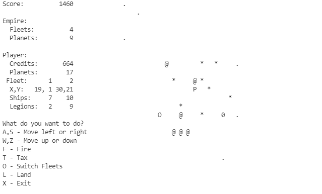

# Cosmic-Conquest

Rick Carlino lead the effort to bring this game to GForth https://github.com/RickCarlino/Cosmic-Conquest-1982.

I enhanced the game for my own 16 bit cell Forth.  It has the following enhancements:

* Reformatted output to a 80 column by 23 line display with added game information on the left and an enlarged galaxy scan on the right,
* Added a spiral galaxy scan to enhanced real-time play, allowing moves while the scan is in progress,
* Added a "long-range" spiral galaxy scan showing an incomplete view of objects farther away (the dots in the image above),
* Input is no longer case sensitive,
* X or x now quits the game, and,
* Eliminated non-standard words.

# Screenshot

# Contents
 
* `pages` original source from [BYTE magazine](https://archive.org/details/byte-magazine-1982-12/page/n131/mode/1up?q=cosmic+conquest)
* `cc_e.f` enhanced version of original game
* `dforth.bin` Forth and Cosmic Conquest binary for 65C02

# How to play on a 6502 Emulator

1. Install [py65](https://github.com/mnaberez/py65).
2. Run py65 monitor, loading the 65C02 binary with `py65mon -m 65c02 -r dforth.bin -i 880a -o 8400`.
3. The Cosmic Conquest Forth source code is located at $4000.  The word LOAD will compile this code.  This will take about 30 seconds.
4. Run Cosmic Conquest with CONQUEST.

# How to play on other systems

My enhanced version of Cosmic Conquest uses standard Forth-2012 words.  It assumes a 16-bit cell.  It should run on other standard Forths provided they accomodate a 16-bit cell.  With other Forths you might need to make minor modifications where FLEETS and F use ! and @ to get my version running on a Forth with larger cells.
